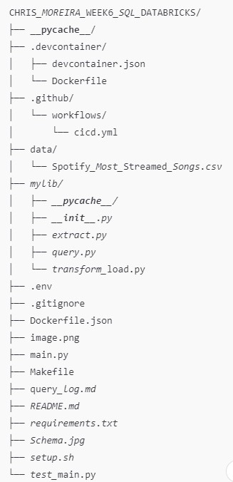
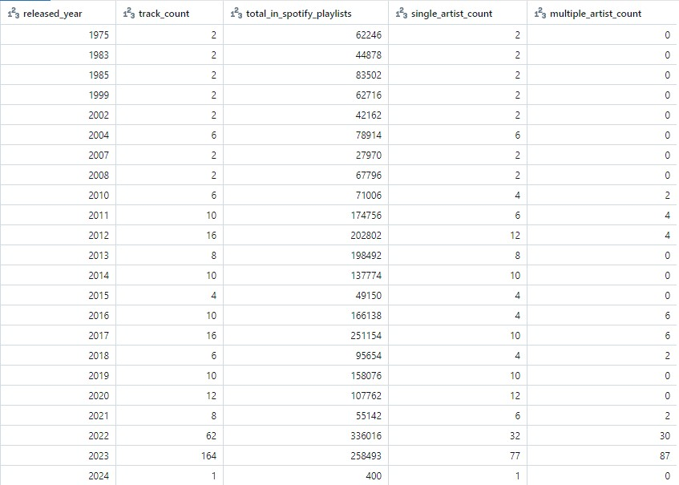
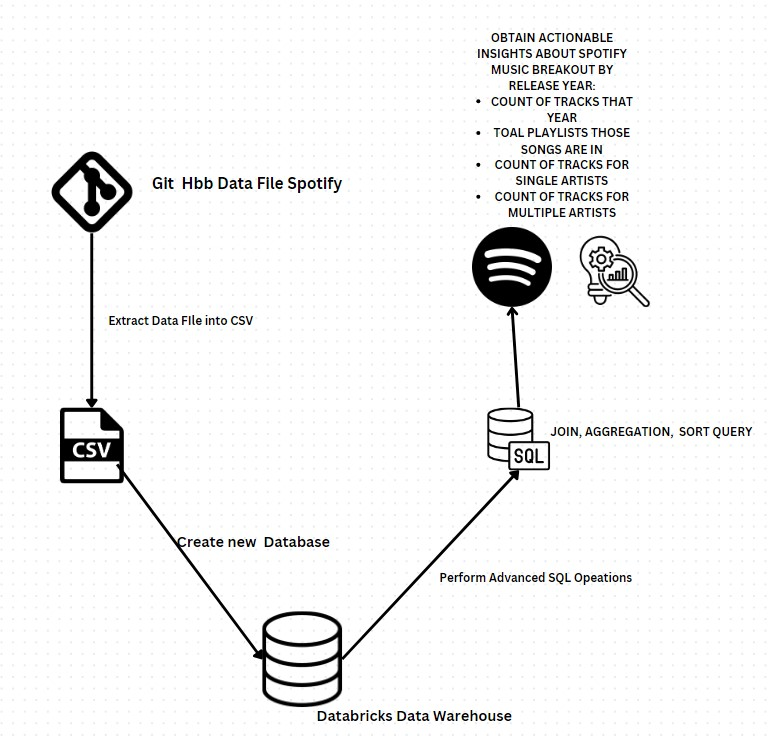

# SQL Database in Databricks Project
# Status Badge for Sucessful Run
[](https://github.com/nogibjj/chris_moreira_week5_python_sql_db_project/actions/workflows/cicd.yml)


# File Structure 



# Project Purpose
In this project we import a csv we work the the Spotify_Most_Streamed Songs csv data. This data is extracted and added into a databricks data lake. Finally A a query is created performs some advances SQL operations for JOINS, Aggregation, and Sorting. The functions are then called, tested and imported into this main directory. The project follows the cicd framework. This framework protects the keys of the server/data lake information that is propietary to the user(myself) and the Duke University. 

The following SQL operations are performe
```sql
#JOINING
 WITH artist_version AS (
            SELECT 
                DISTINCT artist_name,
                CASE 
                    WHEN artist_name LIKE '%,%' THEN 'Multiple Artists'
                    ELSE 'Single Artist'
                END AS Single_Double
            FROM csm_87_SpotifyDB
        )
        SELECT 
            s.*,
            a.Single_Double
        FROM csm_87_SpotifyDB s
        LEFT JOIN artist_version a
        ON s.artist_name = a.artist_name
```
```sql
#Aggregating
SELECT 
            s.released_year,
            COUNT(s.track_name) AS track_count,
            SUM(s.in_spotify_playlists) AS total_in_spotify_playlists,
            COUNT(
                CASE WHEN a.Single_Double = 'Single Artist' THEN 1 END
            ) AS single_artist_count,
            COUNT(
                CASE WHEN a.Single_Double = 'Multiple Artists' THEN 1 END
            ) AS multiple_artist_count
        FROM csm_87_SpotifyDB s
        LEFT JOIN (
            SELECT 
                DISTINCT artist_name,
                CASE 
                    WHEN artist_name LIKE '%,%' THEN 'Multiple Artists'
                    ELSE 'Single Artist'
                END AS Single_Double
            FROM csm_87_SpotifyDB
        ) a
        ON s.artist_name = a.artist_name
        GROUP BY s.released_year
```

```sql
#SORTING
SELECT 
            s.released_year,
            COUNT(s.track_name) AS track_count,
            SUM(s.in_spotify_playlists) AS total_in_spotify_playlists,
            COUNT(
                CASE WHEN a.Single_Double = 'Single Artist' THEN 1 END
            ) AS single_artist_count,
            COUNT(
                CASE WHEN a.Single_Double = 'Multiple Artists' THEN 1 END
            ) AS multiple_artist_count
        FROM csm_87_SpotifyDB s
        LEFT JOIN (
            SELECT 
                DISTINCT artist_name,
                CASE 
                    WHEN artist_name LIKE '%,%' THEN 'Multiple Artists'
                    ELSE 'Single Artist'
                END AS Single_Double
            FROM csm_87_SpotifyDB
        ) a
        ON s.artist_name = a.artist_name
        GROUP BY s.released_year
        ORDER BY s.released_year
```

# Final Query Output with Spotify Track Insight

# Data Flow map for this project



