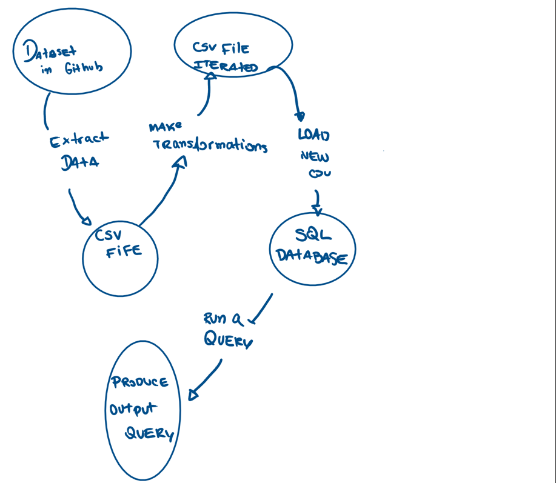

# Databricks Integration Project

# Status Badge for Sucessful Run

# File Structure 
      

# Project Purpose
In this project we import a csv file to first form a SQL database from its data structure. Second, we query this databse performing the sqlite CRUD operations which stand for CREATE, READ, UPDATE, DELETE functions. The functions are then called, tested and imported into this main directory. The project folows the cicd framework, and all requirenments for the key operations and fucntion to run are specified. 

# Data Flow map for this project

